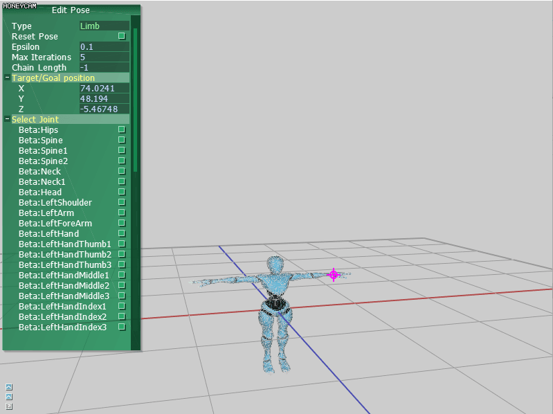
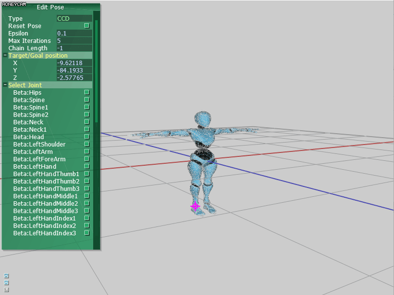
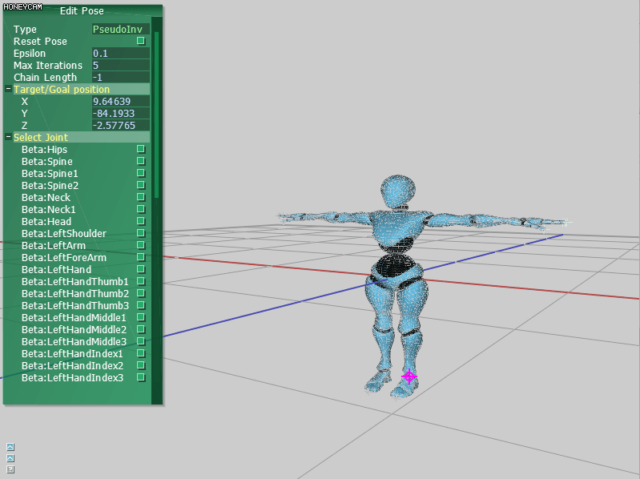

# IKviewer
This project is an assignment of CIS-562 Computer Animation. The project is about different ways to implement Inverse Kinematics, including geometric method, Cyclic Coordinate Descent and pseudo inverse method.
## Geometric Method
Geometric method, as the name implies, is based on geometric positions. It is a straight forward way to perform IK but the down side is that it can’t solve complicated situations since there are many assumptions applied to make the geometric position relatively easier to be calculated.

## CCD Method
CCD is a rather compatible method to solve IK. It will loop through the IK chain to change the joint's position so that the end joint matches its desired position until the error is acceptable or looping through enough rounds.

## Pseudo Inverse
In my opinion, pseudo inverse is the most theoretical way to solve IK. It literally take the increment of position and using the inverse of the Jacobean matrix to calculate the increment of orientation. When acquiring the inverse of Jacobean matrix, it is not guaranteed that the matrix is square(non-square matrix is not invertible), which is the reason why pseudo inverse is used. Also, in practice, damped pseudo inverse is used in case of singular matrix and null space operator is used to keep the posture close to the original posture(which I didn't use as you can see from the gif below XD).

